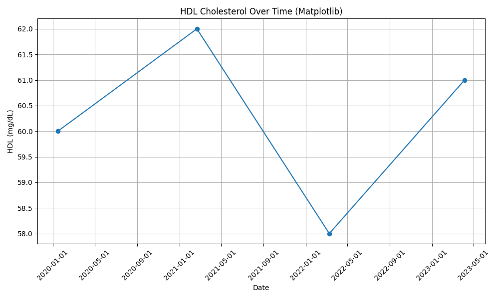

# Jules Lab Experiment

**THIS-IS-AN-EXPERIMENT**, **NO CODE** has been reviewed for **ANY** purpose!

## Python Medical Data Science Project

This project demonstrates the use of Python for handling and visualizing medical data,
specifically focusing on FHIR resources,
pandas for data analysis, and Bokeh and matplotlib for visualization.

It includes utilities for creating example FHIR Patient and Observation
(Cholesterol) data, flattening FHIR bundles for analysis,
and example notebooks in Marimo for visualization.

## Interactive Visualization

You can explore the cholesterol visualization interactively:

- **View on GitHub Pages:** [https://wuxxin.github.io/fhir-research/](https://wuxxin.github.io/fhir-research/)
- **Run locally with Marimo:**

```sh
uv run marimo edit notebooks/hdl_visualize.py
```

## Setup

```sh
make buildenv
```

## Running

### Interactivly edit the Notebook in Marimo

```bash
uv run marimo edit notebooks/hdl_visualize.py
```

### Export the matplotlib plot as image

```bash
uv run python notebooks/hdl_visualize.py -o hdl-matplotlib.png
```



## Docs

```bash
make docs
```

## Testing and Linting

**Run Tests**:

```bash
make test
```

**Run Linter**:

```bash
make lint
```
